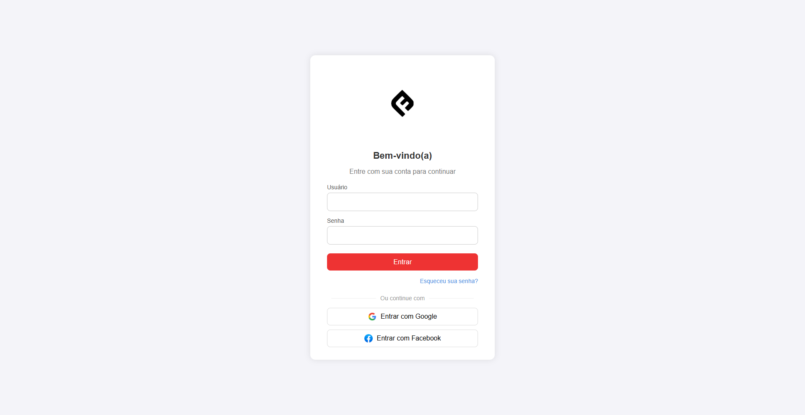
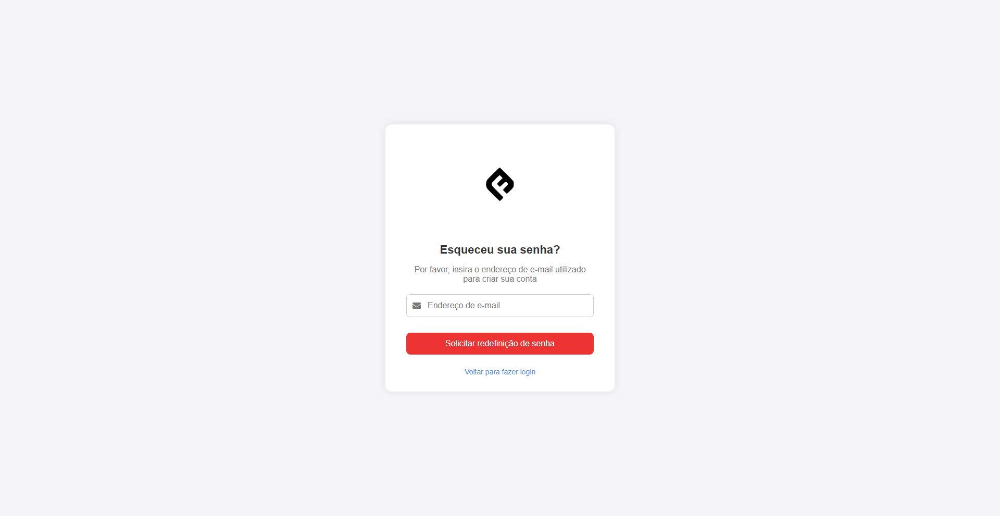
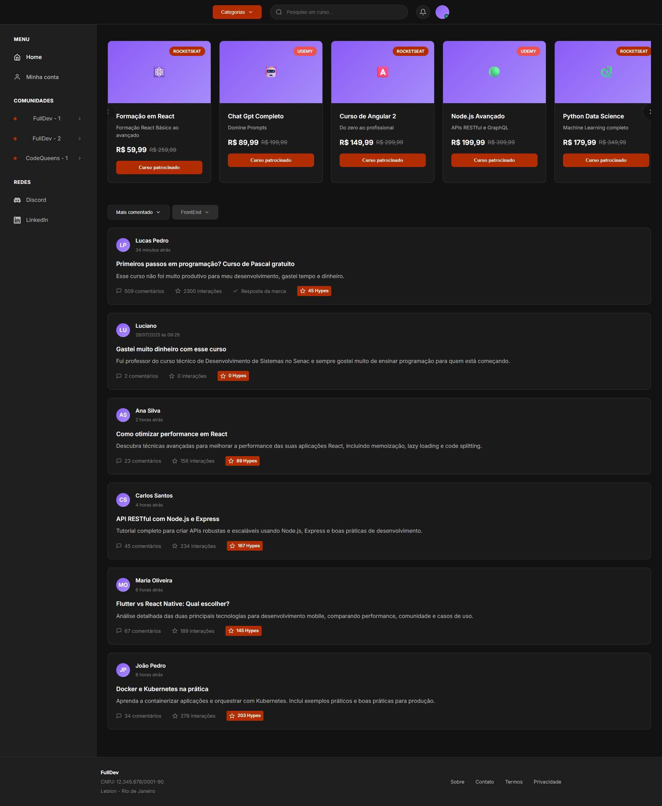
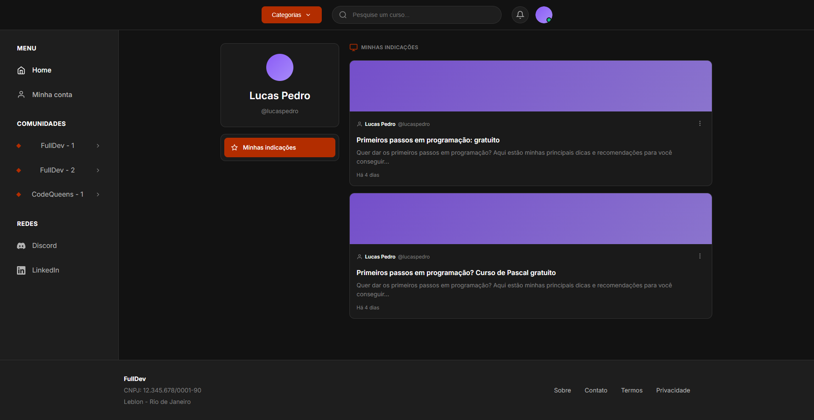
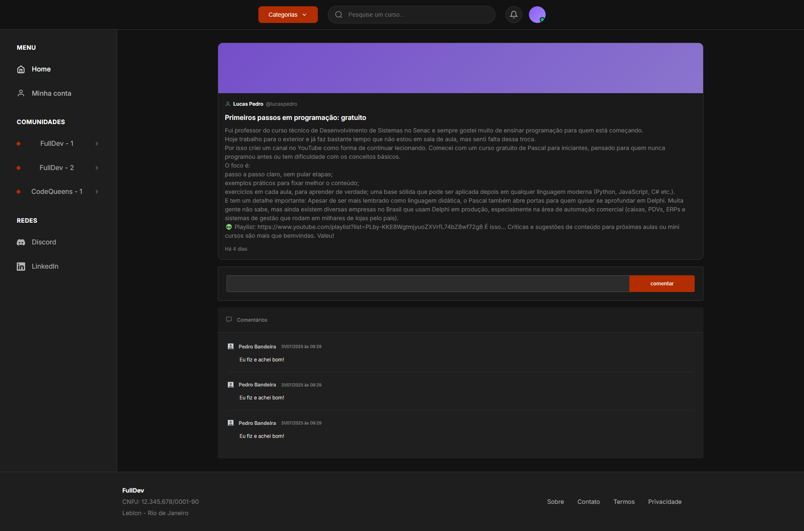

# Template padrão da Aplicação

O layout padrão do site foi construído com as linguagens de marcação HTML e CSS.

As páginas terão como elementos padrões o menu de navegação, o header e o footer, além dos elementos de identidade visual citados abaixo:

Cores: RGB: 

Font-family: 'Inter', -apple-system, BlinkMacSystemFont, 'Segoe UI', Roboto, sans-serif;

O código utilizado para a construção dos elementos citados, incluindo a responsividade, pode ser consultado <a href="../codigo-fonte/">aqui.</a>
As imagens e ícones utilizados no projeto estão disponíveis <a href="../codigo-fonte/assets/imgs/">aqui.</a>

## Tela de login

Exibe informações para o usuário acessar a plataforma.

 

## Tela home

Exibe todas as informaçÕes da plataforma, onde o usuario poderá interagir com as indicações.

## Tela Minha conta

Exibe informações sobre as indicações que ele fez.

## Tela da indicação

Exibe informações detalhadas sobre a indicação que ele clicou.

