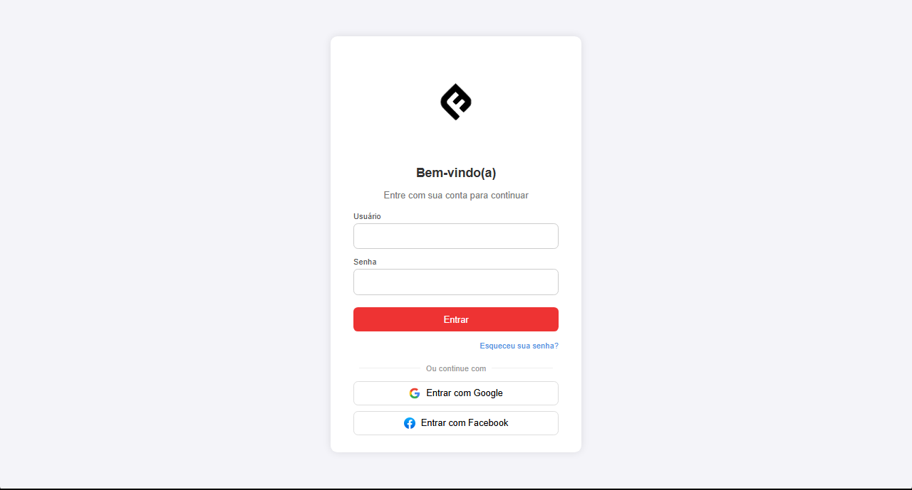
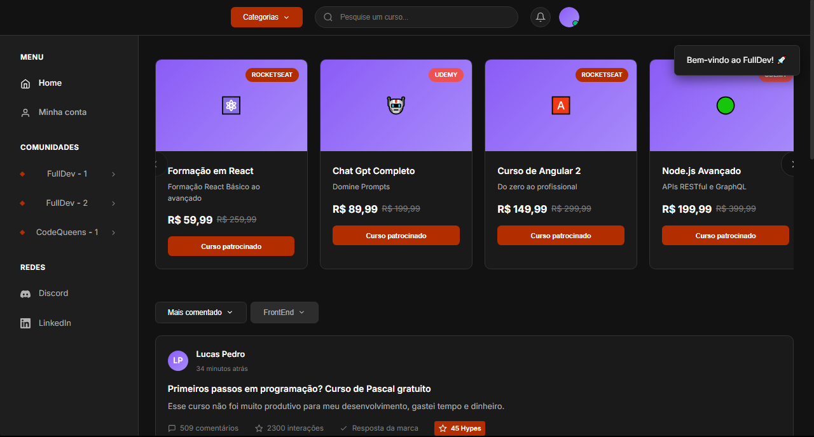
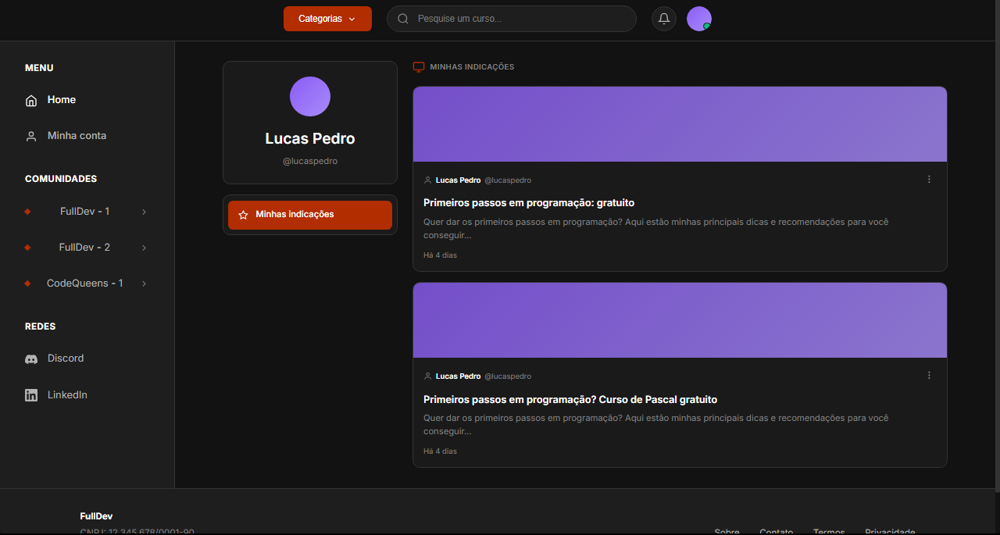
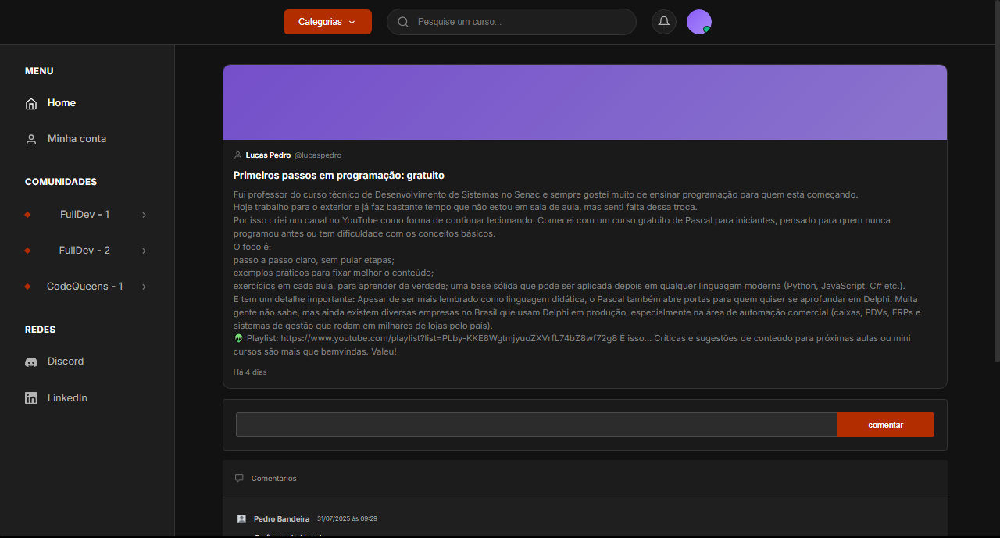

# Programação de Funcionalidades

Este documento apresenta as funcionalidades implementadas na aplicação FullDev Online, relacionando cada tela/módulo aos requisitos funcionais atendidos.

---

## Tela de Login
**Responsável**: Luan  
**Requisitos associados**: RF-01, RF-12, RF-37

### Descrição da Funcionalidade
A tela de login permite ao usuário acessar a plataforma utilizando e-mail e senha, além de oferecer suporte à recuperação de senha e navegação para criação de conta.

### Funcionalidades Implementadas
- ✅ Validação de campos obrigatórios (e-mail e senha)
- ✅ Feedback visual de erro em caso de credenciais inválidas
- ✅ Redirecionamento para a recuperação de senha
- ✅ Link direto para página de cadastro
- ✅ Fluxo simples e objetivo, seguindo o padrão visual definido no Template da Aplicação

### Artefatos da Funcionalidade
- `login/login.html`
- `style/style.css` (elementos visuais compartilhados)
- JavaScript inline (validação e redirecionamentos)

### Requisitos Atendidos
- **RF-01** – Permitir login com validação e fluxo de recuperação
- **RF-37** – Tratamento de erros e mensagens amigáveis

### Exemplo em imagem


---

## Tela de Cadastro (Registro)
**Responsável**: Luan  
**Requisitos associados**: RF-01, RF-02, RF-37

### Descrição da Funcionalidade
Sistema completo de cadastro em 3 etapas que permite ao usuário criar sua conta na plataforma com validação avançada de CPF e estrutura para integração com redes sociais.

### Funcionalidades Implementadas
- ✅ **Etapa 1**: Seleção do método de cadastro (e-mail ou redes sociais)
- ✅ **Etapa 2**: Coleta de dados pessoais com validação de CPF
  - Validação matemática completa (algoritmo mod-11)
  - Verificação de unicidade (impede CPF duplicado)
  - Formatação automática (000.000.000-00)
  - Feedback visual em tempo real
- ✅ **Etapa 3**: Definição de credenciais (e-mail e senha)
  - Confirmação de e-mail
  - Validação de senha forte
  - Checkbox de aceite dos termos
- ✅ Modal de sucesso com redirecionamento automático
- ✅ Persistência de dados via LocalStorage
- ✅ Indicador de progresso (3 dots)
- ✅ Navegação entre etapas com validação

### Artefatos da Funcionalidade
- `register/register.html`
- `register/register-style.css`
- `register/register-script.js` (classe `UserStorage`)

### Requisitos Atendidos
- **RF-01** – Cadastro de usuários com validação de e-mail e senha
- **RF-02** – Validação do perfil do usuário pelo CPF (algoritmo completo + unicidade)
- **RF-37** – Tratamento de erros e mensagens amigáveis com feedback visual

### Estrutura de Dados
```javascript
{
    id: "uuid-gerado",
    registrationMethod: "email",
    cpf: "000.000.000-00",
    email: "usuario@email.com",
    password: "hash-da-senha",
    createdAt: "2025-12-07T10:30:00Z"
}
```

### Exemplo em imagem


---

## Tela Home  
**Responsável**: Lorenzo  
**Requisitos associados**: RF-08, RF-16, RF-15, RF-17, RF-23, RF-12, RF-32, RF-37

### Descrição da Funcionalidade
A Home exibe o feed principal da plataforma com:
- Carrossel de cursos patrocinados
- Listagem de publicações com interações (comentários, hype, respostas de marca)
- Filtros por categoria
- Busca inteligente
- Sistema de compartilhamento social
- Notificações toast

### Funcionalidades Implementadas
- ✅ Renderização dinâmica de cursos e posts via JavaScript
- ✅ Carrossel automático com autoplay e navegação manual
- ✅ Sistema de filtros em tabs (Todos, Frontend, Backend, Mobile, etc.)
- ✅ Interações com posts (comentários, hype, curtidas)
- ✅ Efeitos de hover, contadores animados e simulação de dados em tempo real
- ✅ Barra lateral com comunidades e redes sociais
- ✅ **Sistema de Compartilhamento** (RF-12, RF-32):
  - Modal centralizado com 4 opções sociais
  - WhatsApp, Twitter, LinkedIn, Facebook
  - Botão de copiar link com feedback visual
  - Geração de URLs personalizadas por curso
- ✅ **Sistema de Toast Notifications** (RF-37):
  - 4 tipos: success, error, warning, info
  - Auto-close configurável (3-5 segundos)
  - Animações de entrada/saída
  - Empilhamento de múltiplos toasts
  - Ícones diferenciados por tipo
- ✅ Footer com links para páginas institucionais
- ✅ Integração com LocalStorage para persistência

### Artefatos da Funcionalidade
- `home/index.html`
- `home/script.js`
- `home/style.css`
- `home/home-com-localstorage/index.html` (versão com persistência)
- `home/home-com-localstorage/script.js` (+294 linhas de toast e share)
- `home/home-com-localstorage/style.css` (+455 linhas de estilos)

### Requisitos Atendidos
- **RF-08** – Exibir catálogo de cursos com detalhes
- **RF-16** – Exibir feed inicial com conteúdos em destaque
- **RF-15** – Permitir interações como hype e comentários
- **RF-17** – Respostas oficiais de marcas com selo de verificação
- **RF-23** – Busca global via barra de pesquisa
- **RF-12** – Compartilhamento de curso via link externo
- **RF-32** – Gerar link compartilhável para cursos
- **RF-37** – Tratamento de erros e mensagens amigáveis (sistema de toast)

### Funções JavaScript Principais
```javascript
// Sistema de Toast
showToast(type, title, message, duration)

// Sistema de Compartilhamento
showShareModal(courseId)
shareViaWhatsApp(courseId, courseTitle)
shareViaTwitter(courseId, courseTitle)
shareViaLinkedIn(courseId, courseTitle)
shareViaFacebook(courseId)
copyShareUrl(courseId)

// Validação
validateFormInput(input, validationType)
```

### Exemplo em imagem


---

## Tela Minha Conta  
**Responsável**: Lucas Pedro  
**Requisitos associados**: RF-04, RF-33, RF-11

### Descrição da Funcionalidade
Exibe as informações pessoais do usuário e suas indicações publicadas, permitindo acompanhar o histórico e navegar entre suas publicações.

### Funcionalidades Implementadas
- ✅ Exibição de avatar, nome e username
- ✅ Menu lateral exclusivo para navegação da conta
- ✅ Lista de indicações feitas pelo usuário
- ✅ Card com ações de edição e exclusão (UI preparada, lógica futura)
- ✅ Integração com header, sidebar e busca padrão da aplicação
- ✅ Sistema de navegação entre seções do perfil
- ✅ Estatísticas do usuário (publicações, seguidores, seguindo)

### Artefatos da Funcionalidade
- `minha-conta/minha-conta.html`
- `style/style.css`
- `home/script.js` (funções comuns reutilizadas)

### Requisitos Atendidos
- **RF-33** – Painel simples do usuário
- **RF-04** – Exibição e estrutura para edição futura de perfil
- **RF-11** – Histórico mínimo de interações (publicações feitas)

### Exemplo em imagem


---

## Tela de Publicação  
**Responsáveis**: João Pedro (implementação) + Jeniffer (ajustes e refinamentos)  
**Requisitos associados**: RF-13, RF-15, RF-17, RF-31

### Descrição da Funcionalidade
Página dedicada à visualização completa de uma publicação específica, com detalhes expandidos e suporte para interações.

### Funcionalidades Implementadas
- ✅ Exibição do conteúdo completo da publicação
- ✅ Informações do autor, tempo de publicação e estatísticas
- ✅ Estrutura para comentários futuros
- ✅ Integração com fluxo da Home (listagem → clique → abertura da publicação)
- ✅ Indicadores visuais de hype e interações
- ✅ Card de avaliação com nota visual
- ✅ Tags de categorização (stack, nível, modalidade)

### Artefatos da Funcionalidade
- `publicacao/publicacao.html`
- `style/style.css`
- `home/script.js` (reaproveitado para animações e interações)

### Requisitos Atendidos
- **RF-13** – Exibição de avaliação/publicação feita por um usuário
- **RF-15** – Interações (hype, comentários, likes)
- **RF-17** – Suporte visual para resposta oficial da marca
- **RF-31** – Estrutura para página detalhada, seguindo padrão UI

### Exemplo em imagem


---

## Página de Eventos
**Responsável**: Equipe  
**Requisitos associados**: RF-22, RF-23

### Descrição da Funcionalidade
Listagem de eventos e oportunidades da comunidade, incluindo meetups, workshops, hackathons e vagas de emprego.

### Funcionalidades Implementadas
- ✅ Grid responsivo de cards de eventos
- ✅ Filtros por tipo de evento (Todos, Presencial, Online, Híbrido)
- ✅ Informações detalhadas: data, local, formato, vagas
- ✅ Call-to-action para inscrição
- ✅ Design consistente com o padrão da aplicação
- ✅ Seção de destaque para eventos principais
- ✅ Indicadores visuais (gratuito, vagas limitadas, etc.)

### Artefatos da Funcionalidade
- `eventos/eventos.html`
- `eventos/style.css`

### Requisitos Atendidos
- **RF-22** – Disponibilizar página de eventos e oportunidades
- **RF-23** – Busca e filtros por eventos

### Exemplo em imagem


---

## Páginas Institucionais
**Responsável**: Equipe  
**Requisitos associados**: RF-26, RF-27, RF-37

### Descrição da Funcionalidade
Conjunto de páginas obrigatórias para compliance legal (LGPD) e transparência com os usuários.

### Funcionalidades Implementadas

#### 📘 Sobre Nós (`institucional/sobre.html`)
- ✅ História e missão da plataforma
- ✅ Grid de membros da equipe com fotos e redes sociais
- ✅ Estatísticas animadas (usuários, cursos, avaliações)
- ✅ Contador de números com animação de incremento
- ✅ Timeline de evolução do projeto
- ✅ Seção de valores e diferenciais

#### 📜 Termos de Uso (`institucional/termos.html`)
- ✅ Documento completo com 11 seções
- ✅ Sumário interativo com navegação por âncoras
- ✅ Botão de impressão funcional
- ✅ Checkbox de aceite dos termos
- ✅ Data de última atualização
- ✅ Scroll suave para seções

#### 🔒 Política de Privacidade (`institucional/privacidade.html`)
- ✅ Documento em conformidade com LGPD
- ✅ 10 seções detalhadas sobre coleta e uso de dados
- ✅ Modal de preferências de cookies
- ✅ Formulário de solicitação de dados pessoais
- ✅ Formulário de exclusão de conta (RF-27)
- ✅ Informações sobre direitos do titular
- ✅ Botão de aceitar/personalizar cookies

### Artefatos da Funcionalidade
- `institucional/sobre.html` + `institucional/sobre.js`
- `institucional/termos.html` + `institucional/termos.js`
- `institucional/privacidade.html` + `institucional/privacidade.js`
- `style/style.css` (estilos compartilhados)

### Requisitos Atendidos
- **RF-26** – Páginas institucionais (Sobre, Termos, Privacidade/LGPD)
- **RF-27** – Permitir exclusão da conta e download dos dados (formulários na página de Privacidade)
- **RF-37** – Mensagens amigáveis e tratamento de erros

### Funcionalidades JavaScript
```javascript
// sobre.js
- Contador animado de estatísticas
- Animação de fade-in ao scroll
- Lazy loading de imagens

// termos.js
- Navegação suave por âncoras
- Função de impressão
- Validação de aceite

// privacidade.js
- Modal de cookies
- Formulário de solicitação LGPD
- Salvamento de preferências
- Validação de e-mail
```

### Exemplo em imagem


---

## Resumo de Requisitos Implementados

### ✅ Requisitos Funcionais Atendidos: 20/39 (51%)

| ID | Descrição | Status |
|----|-----------|--------|
| RF-01 | Cadastro e login com validação | ✅ Completo |
| RF-02 | Validação de CPF único | ✅ Completo |
| RF-04 | Estrutura para edição de perfil | ✅ UI pronta |
| RF-08 | Catálogo de cursos | ✅ Completo |
| RF-11 | Histórico de interações | ✅ Completo |
| RF-12 | Compartilhamento de curso | ✅ Completo |
| RF-13 | Criação de publicações | ✅ Completo |
| RF-15 | Comentários e likes | ✅ Completo |
| RF-16 | Feed inicial com destaque | ✅ Completo |
| RF-17 | Resposta oficial de marcas | ✅ Completo |
| RF-22 | Página de eventos | ✅ Completo |
| RF-23 | Busca global e filtros | ✅ Completo |
| RF-26 | Páginas institucionais | ✅ Completo |
| RF-27 | Exclusão de conta/portabilidade | ✅ UI pronta |
| RF-31 | Página de detalhes | ✅ Completo |
| RF-32 | Compartilhamento (link) | ✅ Completo |
| RF-33 | Painel do usuário | ✅ Completo |
| RF-37 | Mensagens amigáveis | ✅ Completo |

### 🔄 Requisitos Parcialmente Implementados

| ID | Descrição | Status |
|----|-----------|--------|
| RF-05 | Preferências e privacidade | 🟡 Modal de cookies |
| RF-21 | Sistema de notificações | 🟡 Toast implementado |

### ⏳ Requisitos Pendentes (19)

- RF-03: Controle de acesso por papéis
- RF-06, RF-07: Onboarding e questionário vocacional
- RF-09, RF-10, RF-29, RF-30: Sistema de recomendação
- RF-14, RF-19, RF-20: Sistema de moderação
- RF-18: Painel da marca
- RF-24, RF-25, RF-34, RF-35, RF-36, RF-39: Área administrativa
- RF-28: Onboarding inicial
- RF-38: Notificações por e-mail

---

## Considerações Técnicas

### 🏗️ Arquitetura
- **Frontend**: HTML5, CSS3, JavaScript ES6+
- **Persistência**: LocalStorage API
- **Design Pattern**: Component-based UI
- **Responsividade**: Mobile-first approach

### 🎨 Padrões de Código
- Variáveis CSS para temas (`:root`)
- Nomenclatura BEM para classes
- Modularização de JavaScript
- Reutilização de componentes

### 📊 Estrutura de Dados (LocalStorage)

```javascript
// Usuários
fulldev_users: [
    {
        id: "uuid",
        cpf: "000.000.000-00",
        email: "usuario@email.com",
        password: "hash",
        createdAt: "ISO-8601"
    }
]

// Usuário logado
fulldev_current_user: {
    id: "uuid",
    email: "usuario@email.com"
}
```

### 🔒 Segurança Implementada
- ✅ Validação de CPF com algoritmo mod-11
- ✅ Verificação de unicidade de CPF
- ✅ Sanitização de inputs
- ✅ Feedback visual de erros
- ✅ Validação client-side (senha forte, e-mail)

### 📱 Responsividade
- ✅ Breakpoints: 1400px, 1200px, 768px, 480px
- ✅ Grid fluido com CSS Grid e Flexbox
- ✅ Tipografia escalável (rem)
- ✅ Imagens responsivas
- ✅ Menu mobile (hamburger)

---

## Considerações Finais

Todas as funcionalidades foram desenvolvidas mantendo:
- ✅ **Consistência visual** em todas as páginas
- ✅ **Acessibilidade** com semântica HTML5
- ✅ **Performance** com lazy loading e otimizações
- ✅ **Usabilidade** com feedback visual claro
- ✅ **Alinhamento** com os requisitos funcionais da Especificação do Projeto
- ✅ **Escalabilidade** com código modular e reutilizável

### Próximos Passos Sugeridos
1. Implementar sistema de recomendação baseado em perfil (RF-09, RF-10)
2. Adicionar onboarding e questionário vocacional (RF-06, RF-07)
3. Desenvolver painel de moderação (RF-14, RF-19, RF-20)
4. Criar área administrativa completa (RF-24, RF-34, RF-35)
5. Implementar controle de acesso por papéis (RF-03)
6. Adicionar backend para persistência real (substituir LocalStorage)
7. Implementar autenticação JWT e criptografia de senhas
8. Adicionar testes automatizados (unitários e E2E)

---

**Última atualização**: 07 de dezembro de 2025  
**Versão**: 1.0.0  
**Status do Projeto**: MVP em desenvolvimento (51% dos requisitos implementados)

